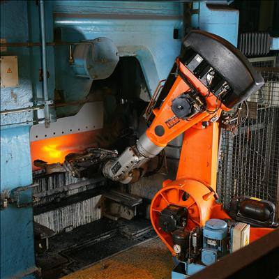

<section id="themes">
	<h2>Themes</h2>
		<p>
			Set your presentation theme: <br>
			<!-- Hacks to swap themes after the page has loaded. Not flexible and only intended for the reveal.js demo deck. -->
                        <a href="#" onclick="document.getElementById('theme').setAttribute('href','css/theme/black.css'); return false;">Black (default)</a> -
			<a href="#" onclick="document.getElementById('theme').setAttribute('href','css/theme/white.css'); return false;">White</a> -
			<a href="#" onclick="document.getElementById('theme').setAttribute('href','css/theme/league.css'); return false;">League</a> -
			<a href="#" onclick="document.getElementById('theme').setAttribute('href','css/theme/sky.css'); return false;">Sky</a> -
			<a href="#" onclick="document.getElementById('theme').setAttribute('href','css/theme/beige.css'); return false;">Beige</a> -
			<a href="#" onclick="document.getElementById('theme').setAttribute('href','css/theme/simple.css'); return false;">Simple</a> <br>
			<a href="#" onclick="document.getElementById('theme').setAttribute('href','css/theme/serif.css'); return false;">Serif</a> -
			<a href="#" onclick="document.getElementById('theme').setAttribute('href','css/theme/blood.css'); return false;">Blood</a> -
			<a href="#" onclick="document.getElementById('theme').setAttribute('href','css/theme/night.css'); return false;">Night</a> -
			<a href="#" onclick="document.getElementById('theme').setAttribute('href','css/theme/moon.css'); return false;">Moon</a> -
			<a href="#" onclick="document.getElementById('theme').setAttribute('href','css/theme/solarized.css'); return false;">Solarized</a>
		</p>
</section>

H:

# Gimbal Lock

Andrés Felipe Guerrero

H:

## Index

 1. Intro<!-- .element: class="fragment" data-fragment-index="1"-->
    * Gimbals and gyroscopes
    * Gimbal lock
 2. Gimbal lock mathematically<!-- .element: class="fragment" data-fragment-index="2"-->
 3.  Gimbal lock in processing<!-- .element: class="fragment" data-fragment-index="3"-->
 4. Known cases<!-- .element: class="fragment" data-fragment-index="4"-->
    * Robotics
    * Apollo 11
 5. Possible solutions<!-- .element: class="fragment" data-fragment-index="5"-->

H:

## Intro
### Gimbals and gyroscopes
<div class="ulist">
    
    <ul style="width: 60%;">
    <p class ="fragment" data-fragment-index="1">
        A gimbal is a pivoted support that allows the rotation of an object about a single axis.
    </p>
    <p class ="fragment" data-fragment-index="2">
        A set of three gimbals, one mounted on the other with orthogonal pivot axes, may be used to allow an object mounted on the innermost gimbal to remain independent of the rotation of its support .
    </p>
    <p class ="fragment" data-fragment-index="3">
        Usually called pitch (X-axis), yaw (Y-axis) and roll (Z-axis).
    </p>
    </ul>
</div>

V:

## Intro
#### Gimbal lock

<div class="ulist">
    
    <ul style="width: 50%;">
    <p class ="fragment" data-fragment-index="1">
        Loss of one degree of freedom in a three-dimensional, three-gimbal mechanism.
    </p>
    <p class="fragment" data-fragment-index="2">
        Occurs when the axes of two of the three gimbals are driven into a parallel configuration, "locking" the system into rotation in a degenerate two-dimensional space. 
    </p>
    <p class="fragment" data-fragment-index="3">
        No gimbal is actually restrained.
    </p>
    </ul>
</div>

H:

## Gimbal Lock Mathematically

<div class="ulist">
    <ul>
    <p class ="fragment" data-fragment-index="1">
        `$
        R
        = 
        \begin{bmatrix}
        1 & 0 & 0 \cr
        0 & cos\alpha & -sin\alpha \cr
        0 & sin\alpha & cos\alpha \cr
        \end{bmatrix}
        \begin{bmatrix}
        cos\beta & 0 & sin\beta \cr
        0 & 1 & 0 \cr
        -sin\beta & 0 & cos\beta \cr
        \end{bmatrix}
        \begin{bmatrix}
        cos\gamma & -sin\gamma & 0 \cr
        sin\gamma & cos\gamma & 0 \cr
        0 & 0 & 1 \cr
        \end{bmatrix}
        $`
    </p>
    <br>
    <p class="fragment" data-fragment-index="2">
    `$\beta = \pi/2 -> cos(\pi/2) = 0 , sin(\pi/2) = 1$`
    </p>
    <br>
    <p class ="fragment" data-fragment-index="3">
        `$
        R
        = 
        \begin{bmatrix}
        1 & 0 & 0 \cr
        0 & cos\alpha & -sin\alpha \cr
        0 & sin\alpha & cos\alpha \cr
        \end{bmatrix}
        \begin{bmatrix}
        0 & 0 & 1 \cr
        0 & 1 & 0 \cr
        -1 & 0 & 0 \cr
        \end{bmatrix}
        \begin{bmatrix}
        cos\gamma & -sin\gamma & 0 \cr
        sin\gamma & cos\gamma & 0 \cr
        0 & 0 & 1 \cr
        \end{bmatrix}
        $`
    </p>
    </ul>
</div>

V:

## Gimbal Lock Mathematically

<div class="ulist">
    <ul>
    <p class ="fragment" data-fragment-index="1">
        `$
        R
        =
        \begin{bmatrix}
        0 & 0 & 1 \cr
        sin\alpha cos\gamma + cos\alpha sin\gamma & -sin\alpha sin\gamma + cos\alpha cos\gamma & 0 \cr
        -cos\alpha cos\gamma + sin\alpha sin\gamma & cos\alpha sin\gamma + sin\alpha cos\gamma & 0 \cr
        \end{bmatrix}
        $`
    </p>
    <br>
    <p class ="fragment" data-fragment-index="2">
        `$
        R
        = 
        \begin{bmatrix}
        0 & 0 & 1 \cr
        sin(\alpha + \gamma) & cos(\alpha + \gamma) & 0 \cr
        -cos(\alpha + \gamma) & sin(\alpha + \gamma) & 0 \cr
        \end{bmatrix}
        $`
    </p>
    <br>
    <p class ="fragment" data-fragment-index="2">
        Changing `$\alpha$` or `$\gamma$` has the same effect. The rotation only occurs on the Z Axis
    </p>
    </ul>
</div>

H:

## Gimbal lock in processing

<a href="https://afelipega.github.io/P5-Sketches/gimbal-lock/">P5 Sketch</a>

V:

## Gimbal lock in processing
#### Code
```processing
function yxz(){
    push();
    // Y - Axis
    rotateY(yaw);
    drawGimbal('outer', 'y');
    push();
    // X - Axis
    rotateX(pitch);
    drawGimbal('middle', 'x');
    push();
    // Z - Axis
    rotateZ(roll);
    drawGimbal('inner', 'z');
    drawXWing();
    pop();
    pop();
    pop();
}
```
H:

## Known Cases
#### Robotics
<div class="ulist">
    
    <ul style="width: 55%;">
    <p class ="fragment" data-fragment-index="1">
        Usually called "wrist flip" due to the use of "triple-roll wrist" where the three axes pass through a common point. Also called wrist singularity.
    </p>
    <p class ="fragment" data-fragment-index="2">
        <i>"A condition caused by the collinear alignment of two or more robot axes resulting in unpredictable robot motion and velocities"<i> - American National Standard for Industrial Robots and Robot Systems
    </p>
    </ul>
</div>

V:

## Known Cases
#### Apollo 11
> "The advantages of the redundant gimbal seem to be outweighed by the equipment simplicity, size advantages, and corresponding implied reliability of the direct three degree of freedom unit" — David Hoag, Apollo Lunar Surface Journal<!-- .element: class="fragment" data-fragment-index="1"-->

They used an indicator that would trigger when near to 85 degrees pitch. When nearing that limit the system simply gave up and froze the platform. <!-- .element: class="fragment" data-fragment-index="2"-->

> How about sending me a fourth gimbal for Christmas? - Mike Collins, Command Module Pilot <!-- .element: class="fragment" data-fragment-index="3"-->

H:

## Possible Solutions
<div class="ulist">
    
    <ul style="width: 55%;">
    <p class ="fragment" data-fragment-index="1">
        Use a fourth gimbal actively driven by a motor to mantain a big angle between 2 axis.
    </p>
    <p class ="fragment" data-fragment-index="2">
        Rotate one or more of the gimbals to a different position when gimbal lock is detected resetting the device.
    </p>
    <p class="fragment" data-fragment-index="3">
        Avoid using gimbals entirely.
    </p>
    </ul>
</div>

H:

# Thanks